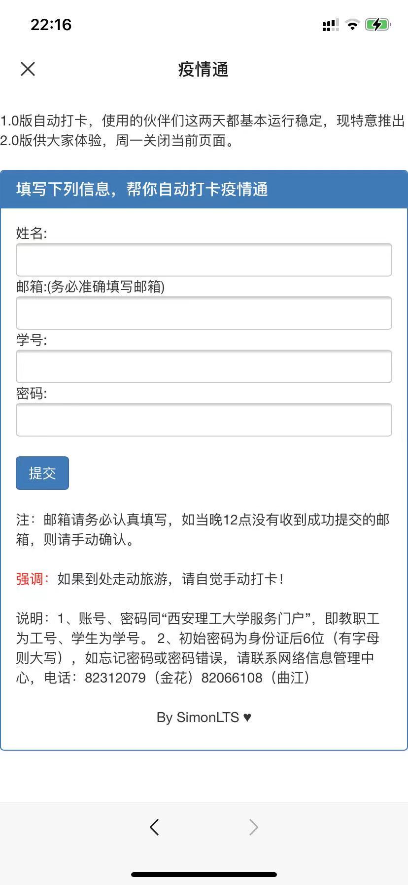

# covid-auto-sign
本项目主要用于疫情期间学生疫情通自动打卡

XAUT-信息收集与自动打卡

**tips:有需要的同学可以研究下auto_sign.py，有彩蛋（表白神器），这部分就不写在readme中了。**


# 一、信息收集
可实现登录验证与批量收集学生信息，将其保存在info.txt下

```bash
npm install  # 安装packge.json中的依赖
nohup node run.js & 1>>log 2>>log # 后台运行run.js,监听3389端口
```
### 收集信息界面如下：  



# 二、自动打卡

1. 修改auto_sign.py文件中153行后更新为自己的信息

2. 执行：
```bash
npm install  # 安装packge.json中的依赖
nohup Python auto_sign.py & 1>>log 2>>log # 后台运行auto_sign.py
```


# 三、TODO

这份代码是去年这个时候写的

代码中还有一些可以优化的地方，比如加入多线程，然后读取info.txt,实现热更新的同时，批量自动打卡